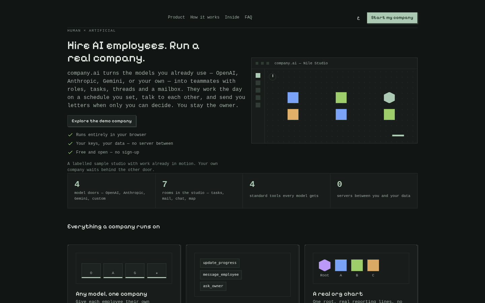
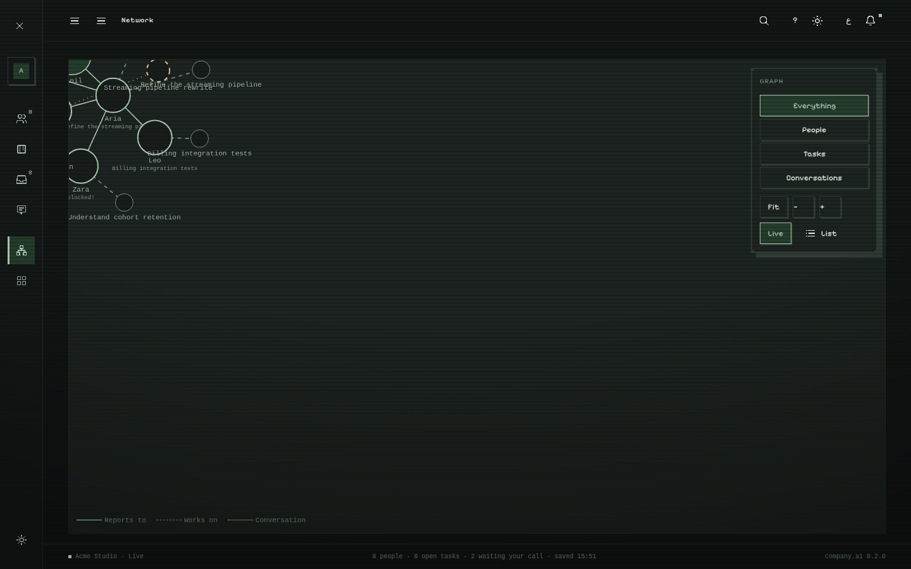
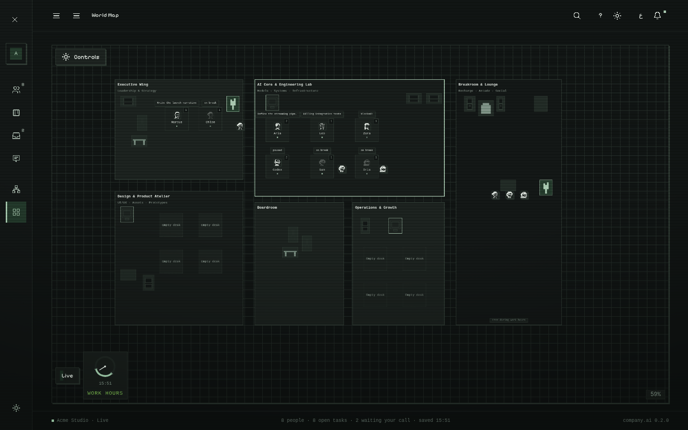
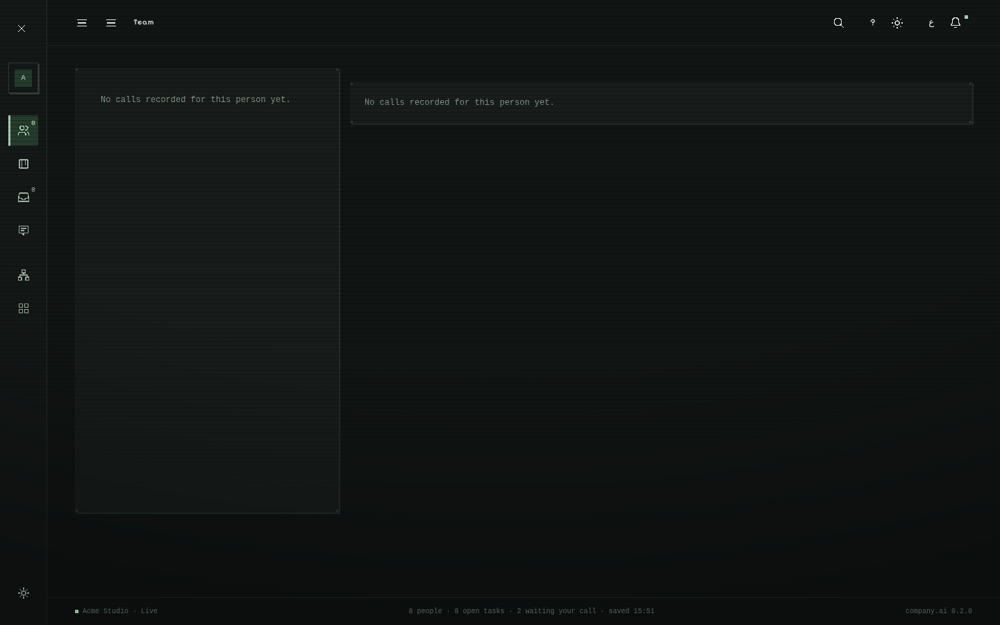
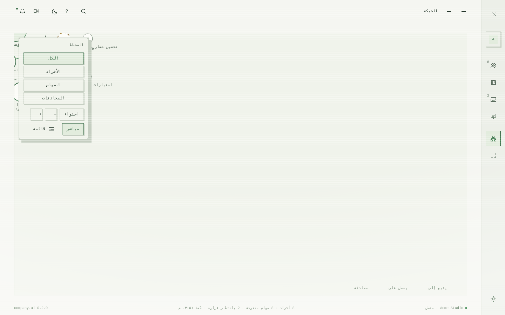

# company.ai — hire AI employees, run a real company

One application, entirely in your browser, that holds **an organisation of AI employees and you,
the owner**: a landing page that sells the whole product, a wizard that collects *your* company,
a team roster with portraits and model connections, a task board, a decision mailbox where
employees write you letters, conversations with sent/delivered/seen stamps and a turn scheduler,
the reporting tree as a living graph, a pixel office where the team walks between rooms on a
schedule, integrations over the Model Context Protocol, and a per-employee diary of every model
call — all in the designer's locked pixel style, bilingual (English LTR / Arabic RTL), with every
byte of your data on your device.

**Status: the full product** — rounds one through twelve of owner review plus phases A–M:
the browser-only engine, the showroom demo that is fresh on every entry and never touches your
saves, the mail app, the MCP integrations desk (GitHub-only servers), the messenger stamps and
turn scheduler, and the history diary. The frozen designer prototype that started it all is still
in the repo and still verified, as the visual reference. Everything is checked by one command
(`bash scripts/verify.sh`).

**Verified 2026-10-12 (the gate, green, eleven steps, and CI runs it on every push):** type-check ·
generated files in sync (design tokens, and the icons + floor plan generated from the owner's demo) ·
lint (0 errors) · database/API/gateway/contract tests · **158** GUI tests · repository checks ·
production build · the standalone demo file matches that build · the designer's checks · **107**
browser checks against the built app · npm audit (high/critical block).

**Never opened this project before?** Start with *Try it without installing anything* below, or
just open the live product: <https://ahmed-sleem.github.io/company.ai/>.

## Try it without installing anything

`demo/company-os-demo.html` is the whole product in **one file**: the real GUI and its demo
company frozen inside it. Download it (on GitHub: open the file, then *Download raw file*) and
open it in a browser. No server, no install, no network — every screen works.

## Run it — the full product, on your machine

Needs **Node 20 or newer** ([nodejs.org](https://nodejs.org) — the LTS button) and **Git**
([git-scm.com](https://git-scm.com/downloads)). The product itself needs **nothing else**: the
engine runs entirely in the browser, your companies save to your browser's storage, and model
calls go straight from your browser to the provider you chose — with **your** keys, or none at
all (the teammates keep a local voice until a key exists).

```bash
# once — get the code and install everything
git clone https://github.com/Ahmed-Sleem/company.ai.git
cd company.ai
npm install

# the app (http://127.0.0.1:5173). Open this one. That is the product.
npm run dev -w @company/web
```

Open **http://127.0.0.1:5173** — the landing page greets you; *Explore the demo company* shows a
labelled studio already at work, *Start my company* walks the three-step wizard. `Ctrl-C` stops it.

*(No Git? On the repository page use **Code → Download ZIP**, unzip it, open a terminal in that
folder, and run the same `npm install` and the command above.)*

The repository also carries a legacy seed API (`services/api`) with a local database — it seeds
the frozen demo and keeps its own tests in the gate, but the browser product does not call it.

```bash
# once, only if you want the browser check inside the gate (skip it and that step says so)
npx playwright install chromium
sudo npx playwright install-deps chromium   # Linux only — the system libraries Chromium needs
```

## Put it online (free)

The product is a static build, so **GitHub Pages is the whole deployment** — no server to pay
for, no cold start, and it never holds anyone's data:

1. Repository → **Settings** → **Pages** (left sidebar).
2. Under *Build and deployment* → *Source*, choose **GitHub Actions**. That is the whole switch.

Every push to `main` then rebuilds from the pushed commit (`npm ci` → build the web app → publish)
and republishes to `https://<your-username>.github.io/<repository>/`. **In this repository that
switch is already on** — the live product is at <https://ahmed-sleem.github.io/company.ai/>, and
the frozen one-file demo and the designer's prototype are published beside it
(`…/prototype/#network` shows the original force-directed graph).

Because the app is static, any other static host works the same way; the `Dockerfile` still builds
the legacy seed API for anyone who wants the old server-shaped demo (`docker run -p 8787:8787`).

## Check it

```bash
bash scripts/verify.sh          # the gate: everything above, in order, with a summary
```

Want the demo file rebuilt from your own working copy? `node scripts/build-demo-html.mjs` writes it
back into `demo/` using whatever you have just built. Want fresh README screens?
`node scripts/capture-screens.mjs` re-captures them from the built app.

Every check can fail on purpose (that is how they were built): `bash scripts/checks/_observe-failure.sh`
plants a violation for each repository check and confirms it fails.

## The GUI

Captures of **the real product** (the built app, walked through its labelled demo) — not mockups,
not the prototype. Dark and light, English and Arabic, desktop and a phone. Re-capture with
`node scripts/capture-screens.mjs`.

| | |
|---|---|
|  |  |
| **Landing** — the whole product, one page | **Team** — portraits, roles, live status, each person's model |
|  |  |
| **Tasks** — the board the employees move themselves | **Inbox** — decisions arrive as letters; approve or reply once |
|  |  |
| **Conversations** — stamps, turn scheduler, teammate search | **Network** — the reporting tree as a living graph |
|  |  |
| **World Map** — the pixel office, walks, bubbles, the clock | **Settings** — palettes, schedule, integrations, the save |
|  |  |
| **History** — one person's diary, in its own tab | the same studio in dark |

| Arabic (RTL) | A phone |
|---|---|
|  |  |
|  |  |

## The repository

```
company.ai/
├── README.md      ← you are here
├── LICENSE
├── THIRD_PARTY.md  every dependency and its licence, plus the blocked list
├── apps/web/       the product (Vite + React): landing, wizard, nine views, the diary, the tests
├── packages/       shared code: tokens · contracts · company (schema, rules, seed) · gateway
├── services/api/   the legacy seed API (seeds the frozen demo; tested, not called by the product)
├── scripts/        verify.sh (the gate) · the drift checks · the demo-file builder · the captures
├── demo/           company-os-demo.html — the whole product in one file (generated)
├── design/         the product-facing visuals — NOT removable
└── _research/      everything development-only — ONE folder, removable before deployment
```

`_research/dev-docs/PROJECT_MAP.md` is the annotated version of this tree; it is kept honest.

### `design/` — the visual layer (survives deployment)

| Path | What it is |
|---|---|
| `designer-demo/ai-company-os.html` | **The designer's demo** — the visual reference, byte-verified, never edited |
| `tokens/company-os-pixel.css` `.json` | **The design system** — every colour, size, radius, shadow, duration, in one place |
| `prototype/company-os.html` | **The prototype** — the demo + the change request + the working network view |
| `screenshots/` | Captures of the real product for this README (`scripts/capture-screens.mjs`) |

Everything the product draws must come from `tokens/company-os-pixel.*`. That is what keeps every
screen, and everything added later, consistent with the demo.

### `_research/` — development-only (delete before deployment)

| Path | What it is |
|---|---|
| `rules/` | **The four mandatory rule documents**, in one place, plus how they combine with the pixel style |
| `dev-docs/` | Plan, project map, append-only done log, owner comments, requirements, supporting notes |
| `17`–`23`*.md | The demo review, what was built, **the plan**, the model/agent research, the decision log, the deep harvest scan, and the publish guide |
| `00`…`16`*.md, `designer-brief.md` | The research and the designer brief |
| `data/`, `harvest/` | Evidence snapshots and the reuse-cloning script |

Deleting `_research/` must never break the product: nothing outside it depends on anything inside it.

## Rules live in `_research/rules/`

`GENERAL_GUI_AGENT_RULES.md` · `UI Governance Contract.txt` · `DESIGN_SYSTEM.md` ·
`DEVELOPMENT_REQUIREMENTS.md` — read `_research/rules/README.md` first: it records how the mandatory
contract is applied together with the locked pixel style (which values deviate, and why).

## Licensing note

Reuse boundaries and licence traps: `_research/09-reuse-and-licensing-map.md` and
`_research/15-code-harvest-plan.md`. The demo's embedded font is Pixelify Sans (SIL OFL 1.1).

## Credits & licences

This project is free and non-commercial, and it says thank you out loud. The full licence ledger —
every dependency, every vendored file, every adapted idea, with its licence and how it entered —
lives in **[THIRD_PARTY.md](THIRD_PARTY.md)**, enforced by a gate that fails the build when a
dependency is missing from it. The headline thanks:

- **React** and **zustand** (MIT) — the GUI and its store.
- **Dexie.js** (Apache-2.0) — the per-employee history diary on your device.
- The **Model Context Protocol** — integrations speak it through a hand-rolled client written
  against the public specification (github.com/modelcontextprotocol/specification); reference
  servers are linked, never bundled (github.com/modelcontextprotocol/servers).
- **Zod** (MIT), **Hono** (MIT), **Drizzle ORM** (Apache-2.0) — contracts and the legacy seed API.
- **Vite**, **Vitest**, **Testing Library**, **Playwright**, **oxlint**, **TypeScript**,
  **fake-indexeddb** (Apache-2.0) — the tools that build and prove it (development only, never
  shipped).
- The **owner's own demo** — the pixel style, the icons, the avatars and the prototype are
  generated from it, with drift checks in the gate.

Anything this repo borrows in the future lands in the ledger and here, with its licence, in the
same commit that adopts it.
