# company.ai — an agent company you can see and run

One application that holds **an organisation of AI employees and humans**: a task board + decision
inbox, the company's reporting structure, conversations (with a visible model selector and voice
notes), and a visual network of the company — all in one GUI, in the designer's locked pixel style,
bilingual (English LTR / Arabic RTL).

**Status: P0 built, plus the owner's own additions** — the World Map (their studio floor, ported from
their demo and drift-checked against it), the five palettes, a custom accent that keeps its contrast,
the screen effect and the collapsed sidebar (both in Settings, both on by default), and build mode
inside the world. The designer's prototype with the network view is still in the repo and still
verified. Everything is checked by one command (`bash scripts/verify.sh`).

**Verified 2026-10-06 (the gate, green, ten steps):** type-check · generated files in sync (design
tokens, and the icons + floor plan generated from the owner's demo) · lint (0 errors) · **83**
database/API/gateway/contract tests · **86** GUI tests · repository checks · production build · the
standalone demo file matches that build · the designer's **11** checks · **58** browser checks against
the real API. The demo file has **10** checks of its own.

**Never opened this project before?** Start with *Try it without installing anything* below.

## Try it without installing anything

`demo/company-os-demo.html` is the whole product in **one file**: the real GUI, its data and its API
frozen inside it. Download it (on GitHub: open the file, then *Download raw file*) and open it in a
browser. No server, no install, no network — every screen works, and creating or moving a task works
too (the changes last until you reload).

## Run it — the full product, on your machine

Needs **Node 20 or newer** ([nodejs.org](https://nodejs.org) — the LTS button) and **Git**
([git-scm.com](https://git-scm.com/downloads)). Nothing else: the database is a local file, and model
calls go to an offline mock, so there are **no keys and no spend**.

```bash
# once — get the code and install everything
git clone https://github.com/Ahmed-Sleem/company.ai.git
cd company.ai
npm install

# terminal 1 — the API (http://127.0.0.1:8787). Leave it running.
npx tsx services/api/src/server.ts

# terminal 2 — the app (http://127.0.0.1:5173). Open this one.
npm run dev -w @company/web
```

Open **http://127.0.0.1:5173** — that is the product. `Ctrl-C` in each terminal stops them. The
database is seeded on first start and kept in `.data/`; delete that folder to start fresh.

*(No Git? On the repository page use **Code → Download ZIP**, unzip it, open a terminal in that
folder, and run the same `npm install` and the two commands above.)*

```bash
# once, only if you want the browser check inside the gate (skip it and that step says so)
npx playwright install chromium
sudo npx playwright install-deps chromium   # Linux only — the system libraries Chromium needs
```

## Put it online (free)

Two things can be online, and they answer different questions. Both are already configured in this
repository — neither needs a credit card, and neither needs you to touch a terminal.

| What goes online | Where | What it costs | What it is for |
|---|---|---|---|
| **The demo file** — the whole product in one HTML file | **GitHub Pages** (`·/.github/workflows/demo-pages.yml`) | Free forever, never sleeps, no cold start | The link you can send anyone, or open on a phone |
| **The full product** — API, database and app | **Render**, free plan (`render.yaml` + `Dockerfile`) | Free; sleeps after 15 minutes idle, wakes in ~30–60 s | Using the real thing, against a live API |

### The demo file on GitHub Pages — two clicks, once

1. Repository → **Settings** → **Pages** (left sidebar).
2. Under *Build and deployment* → *Source*, choose **GitHub Actions**. That is the whole switch.

Every push to `main` then republishes it by itself, to:

```
https://<your-username>.github.io/<repository>/
```

**In this repository that switch is already on** — the demo is live at
<https://ahmed-sleem.github.io/company.ai/> and republishes on every push to `main`.

### The full product on Render — four clicks, once

1. Go to **render.com** and **sign in with GitHub** (no card required for the free plan).
2. **New** → **Blueprint**.
3. Pick this repository. Render reads `render.yaml` by itself and shows what it will create.
4. **Apply** — the first build takes a few minutes; then the service is at
   `https://company-os.onrender.com` (Render adds a suffix if the name is taken).

`render.yaml` describes one service. It is the API, and it serves the built app from the same origin
(`services/api/src/static.ts`), so there is one URL, one dashboard and nothing to configure — and
every push to `main` redeploys it.

**What to expect from the free plan:** the instance sleeps after 15 minutes without visitors, so the
first visit after a quiet spell takes ~30–60 seconds to wake; after that it is quick. Free instances
have no persistent disk, so the database is re-seeded on each deploy — right for a demo. To keep real
data, set `DATABASE_URL` to a hosted Postgres and nothing else changes.

### Anywhere else

The `Dockerfile` builds the whole product, so any Docker host works:

```bash
docker build -t company-os .
docker run --rm -p 8787:8787 company-os     # → http://localhost:8787
```

### While developing

- Every push to `main` updates both of the above by itself — that is the point of wiring them now.
- For a live view of your own machine before pushing anything, a tunnel gives a public HTTPS URL in
  one command without deploying: `cloudflared tunnel --url http://localhost:5173` (the dev server
  already accepts any hostname).
- **`nip.io` is not a hosting service** — it is DNS only: it maps any name to an IP address
  (`company.203.0.113.9.nip.io` → `203.0.113.9`). It does not run anything, so it cannot host this,
  and neither Pages nor Render needs it. It is useful in exactly one case: running the product on a
  machine that has a public IP of its own (a free Oracle Cloud VM, a home server) and wanting a name
  for it without buying a domain. If you ever want that setup, say so and it can be done — the
  `Dockerfile` above is all that machine would need.

## Check it

```bash
bash scripts/verify.sh          # the gate: everything above, in order, with a summary
```

Want the demo file rebuilt from your own working copy? `node scripts/build-demo-html.mjs` writes it
back into `demo/` using whatever you have just built.

Every check can fail on purpose (that is how they were built): `bash scripts/checks/_observe-failure.sh`
plants a violation for each repository check and confirms it fails.

## The GUI

Real captures of the prototype (`design/prototype/company-os.html`) — not mockups. Dark and light,
English and Arabic, desktop and mobile. Re-capture with `node design/screenshots/shots.mjs`.

| | |
|---|---|
| 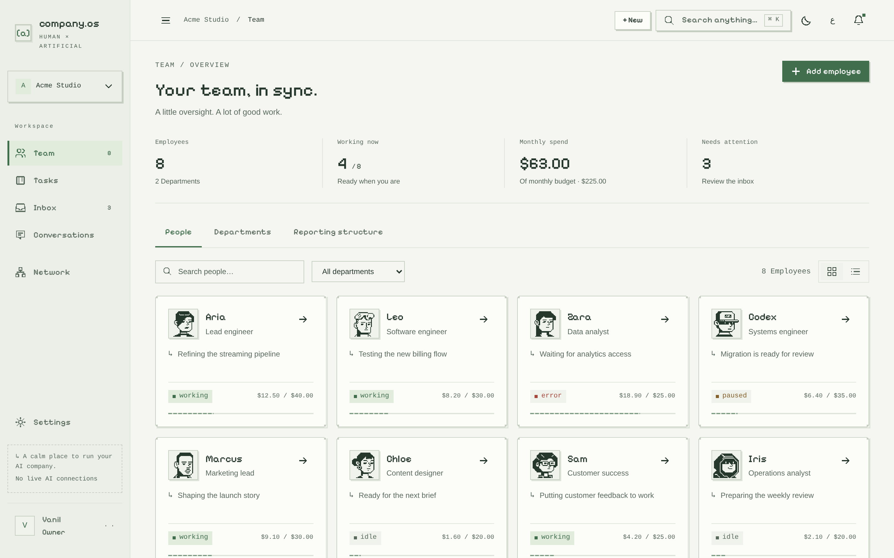 | 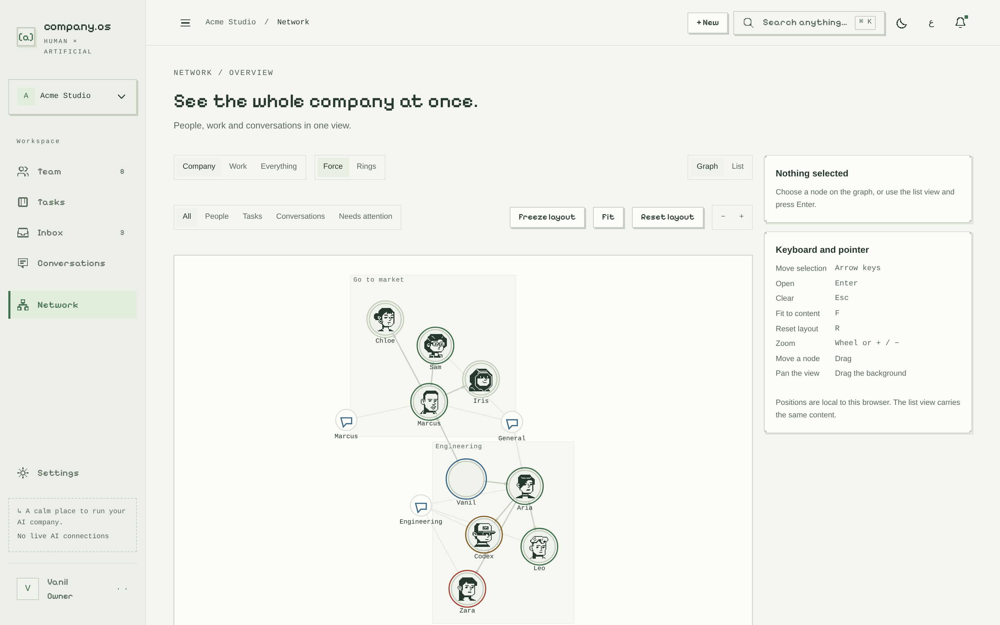 |
| **Team** — the roster, budgets and live status | **Network** — the whole company in one view |
| 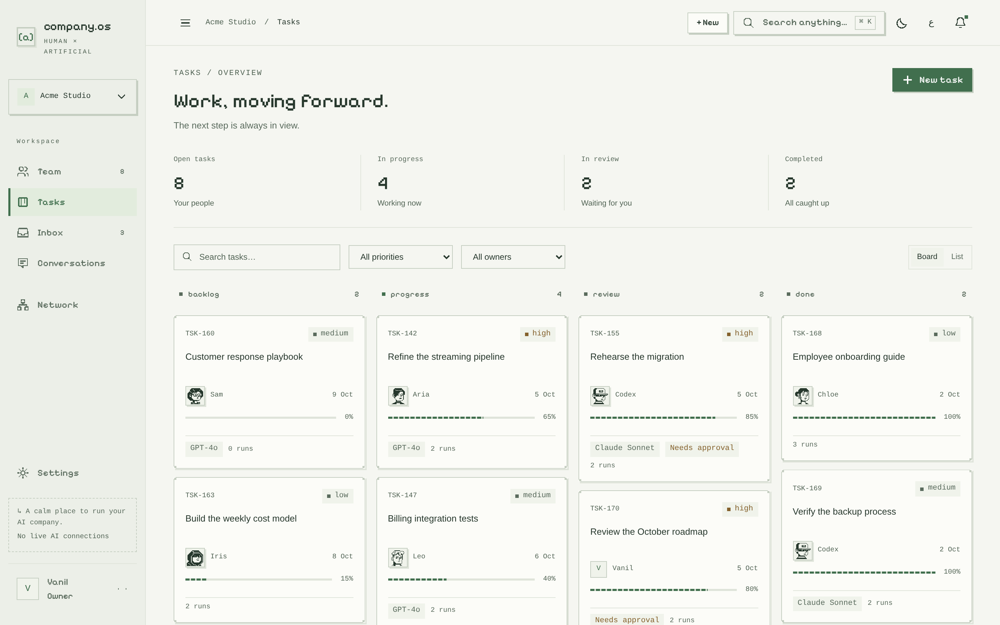 | 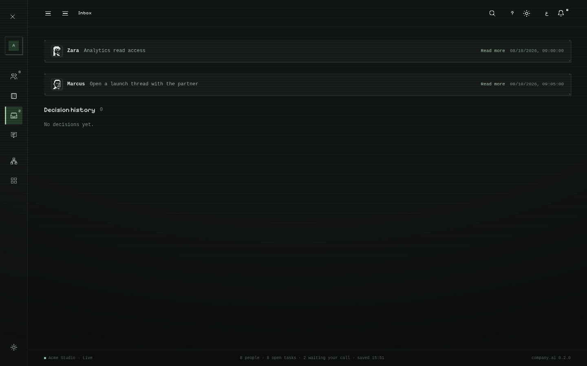 |
| **Tasks** — four stages, AI facts on the card | **Inbox** — decisions with cost and cost of delay |
| 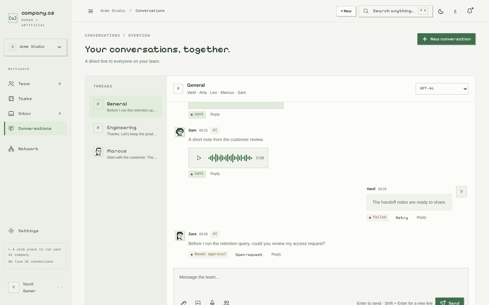 | 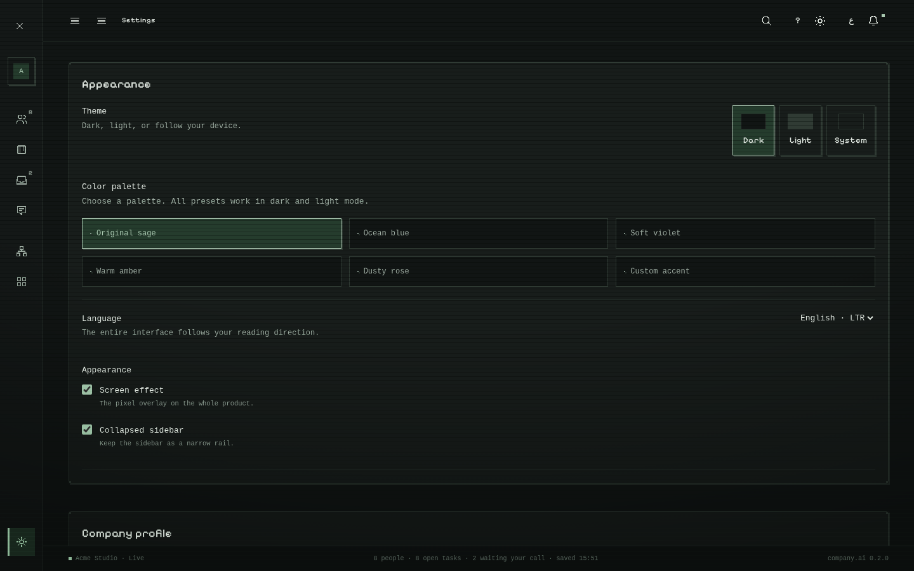 |
| **Conversations** — one thread, any model | **Settings** — appearance, palettes, language, states |

| Dark | Arabic (RTL) |
|---|---|
| 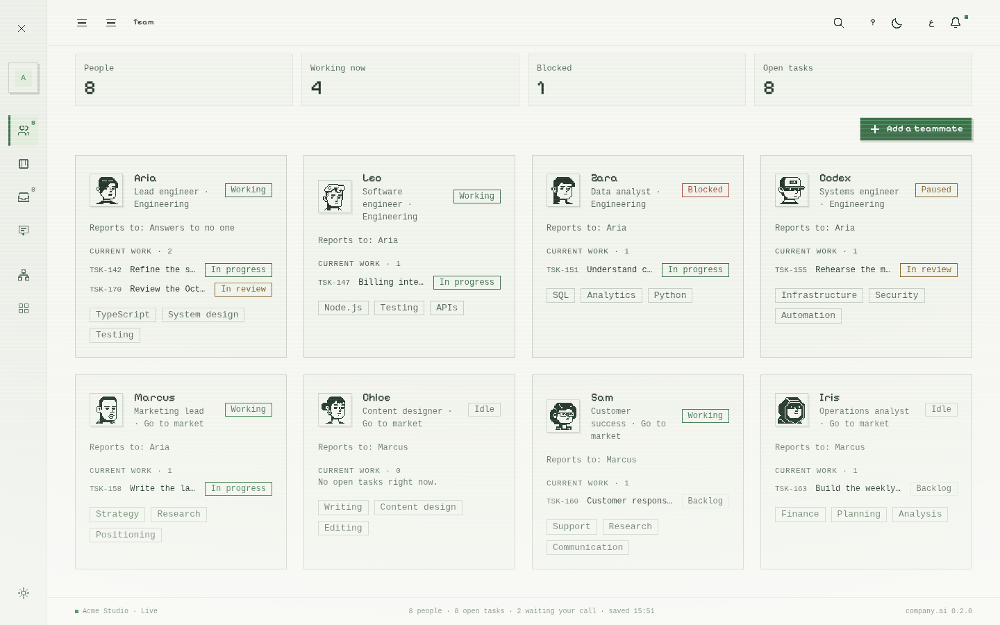 | 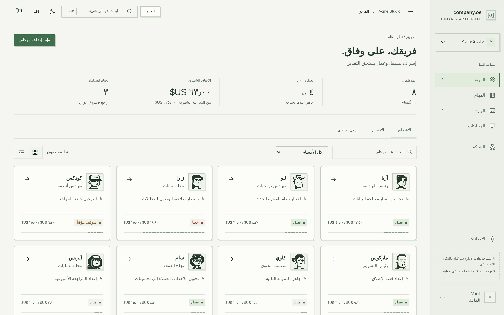 |
| 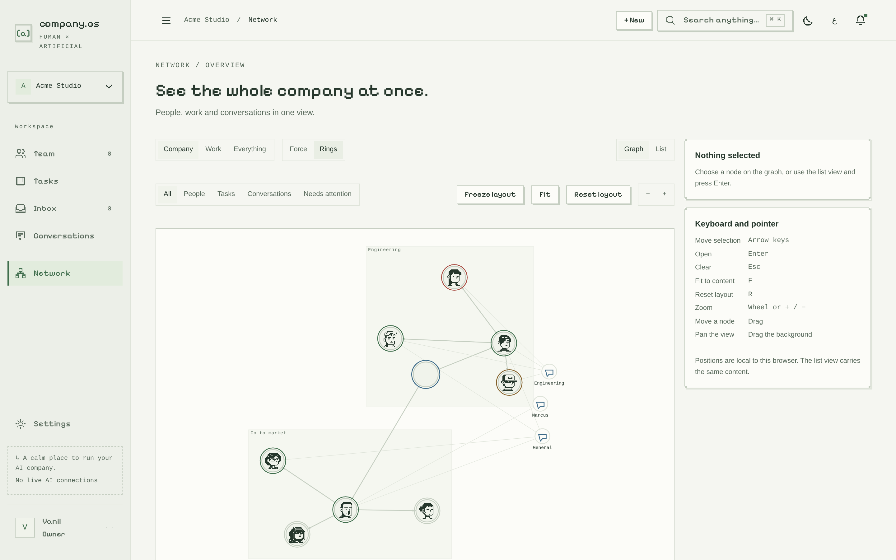 | 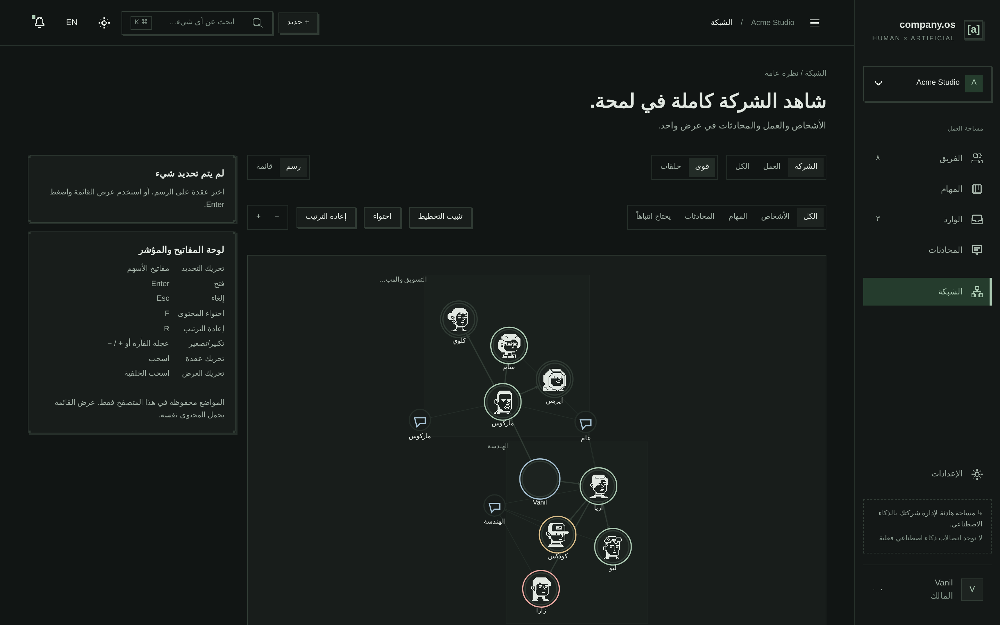 |
| 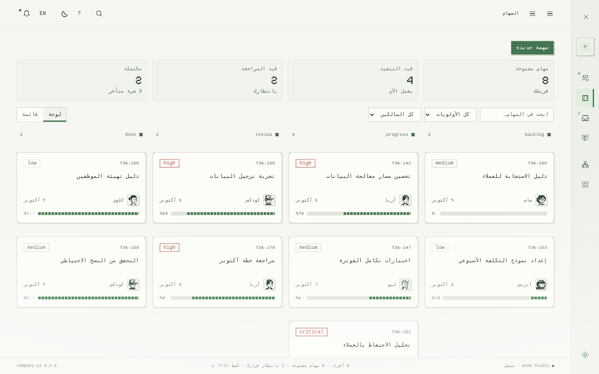 | 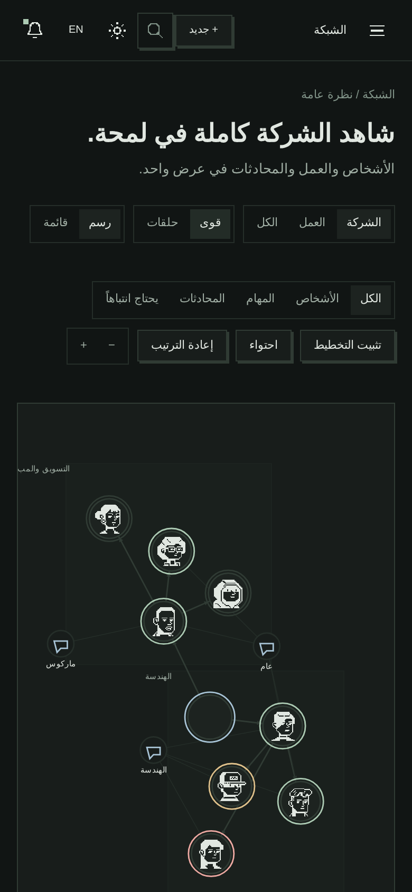 |

## The repository

```
company.ai/
├── README.md      ← you are here
├── LICENSE
├── THIRD_PARTY.md  every dependency and its licence, plus the blocked list
├── apps/web/       the GUI (Vite + React): the shell, seven views, the world, the tests
├── packages/       shared code: tokens · contracts · company (schema, rules, seed) · gateway
├── services/api/   the HTTP surface the GUI talks to
├── scripts/        verify.sh (the gate) · the drift checks · the demo-file builder
├── demo/           company-os-demo.html — the whole product in one file (generated)
├── design/         the product-facing visuals — NOT removable
└── _research/      everything development-only — ONE folder, removable before deployment
```

`_research/dev-docs/PROJECT_MAP.md` is the annotated version of this tree; it is kept honest.

### `design/` — the visual layer (survives deployment)

| Path | What it is |
|---|---|
| `designer-demo/ai-company-os.html` | **The designer's demo** — the visual reference, byte-verified, never edited |
| `tokens/company-os-pixel.css` `.json` | **The design system** — every colour, size, radius, shadow, duration, in one place |
| `prototype/company-os.html` | **The prototype** — the demo + the change request + the working network view (open this one) |
| `prototype/graph.js` `.css`, `prototype-changes.css`, `build-prototype.py`, `verify.mjs` | The network view, the changes, the rebuild script, the verification gate |
| `archive/gui-scaffold.html` | The first scaffold, kept for reference only (superseded) |

Everything the product draws must come from `tokens/company-os-pixel.*`. That is what keeps every
screen, and everything added later, consistent with the demo.

### `_research/` — development-only (delete before deployment)

| Path | What it is |
|---|---|
| `rules/` | **The four mandatory rule documents**, in one place, plus how they combine with the pixel style |
| `dev-docs/` | Plan, project map, append-only done log, supporting notes |
| `17`–`23`*.md | The demo review, what was built, **the plan**, the model/agent research, the decision log, the deep harvest scan, and the publish guide |
| `00`…`16`*.md, `designer-brief.md` | The research and the designer brief |
| `data/`, `harvest/` | Evidence snapshots and the reuse-cloning script |

Deleting `_research/` must never break the product: nothing outside it depends on anything inside it.

## Rules live in `_research/rules/`

`GENERAL_GUI_AGENT_RULES.md` · `UI Governance Contract.txt` · `DESIGN_SYSTEM.md` ·
`DEVELOPMENT_REQUIREMENTS.md` — read `_research/rules/README.md` first: it records how the mandatory
contract is applied together with the locked pixel style (which values deviate, and why).

## Licensing note

Reuse boundaries and licence traps: `_research/09-reuse-and-licensing-map.md` and
`_research/15-code-harvest-plan.md`. The demo's embedded font is Pixelify Sans (SIL OFL 1.1).
